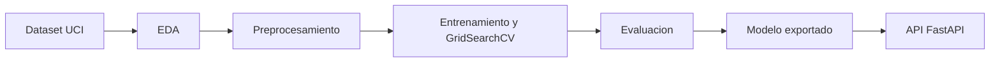

<div align="center">
  <table>
    <thead>
      <tr>
        <th>
          
        </th>
        <th>
          <span style="font-weight:bold;">UNIVERSIDAD LA SALLE DE AREQUIPA</span><br />
          <span style="font-weight:bold;">FACULTAD DE INGENIERÍAS Y ARQUITECTURA</span><br />
          <span style="font-weight:bold;">DEPARTAMENTO ACADEMICO DE INGENIERÍA Y MATEMÁTICAS</span><br />
          <span style="font-weight:bold;">CARRERA PROFESIONAL DE INGENIERÍA DE SOFTWARE</span>
        </th>
      </tr>
    </thead>
  </table>
</div>

<div align="center">
  <h2 style="font-weight:bold;">TRABAJO FINAL</h2>
</div>

# Predictor de Desercion Estudiantil - Backend

Backend del proyecto final de Inteligencia Artificial para predecir desercion estudiantil mediante Machine Learning y exponer el resultado por una API REST con FastAPI.

<div align="center">
  <table>
    <tbody>
      <tr>
        <td align="center"><strong>Semestre</strong></td>
        <td align="center"><strong>Docente</strong></td>
        <td align="center"><strong>Curso</strong></td>
      </tr>
      <tr>
        <td align="center">2026-I</td>
        <td align="center">Vicente Enrique Machaca Arceda</td>
        <td align="center">Inteligencia Artificial</td>
      </tr>
    </tbody>
  </table>
</div>

## Integrantes

1. Rodrigo Emerson Infanzón Acosta
2. Carlos Daniel Aguilar Chirinos
3. Piero Omar De La Cruz Mancilla
4. Iben Omar Flores Polanco

## Tecnologías utilizadas

[![Python][Python]][python-site]
[![FastAPI][FastAPI]][fastapi-site]
[![Pandas][Pandas]][pandas-site]
[![Scikit-Learn][ScikitLearn]][scikit-site]
[![Pytest][Pytest]][pytest-site]
[![Git][Git]][git-site]
[![GitHub][GitHub]][github-site]

[Python]: https://img.shields.io/badge/Python-3776AB?style=for-the-badge&logo=python&logoColor=white
[python-site]: https://www.python.org/
[FastAPI]: https://img.shields.io/badge/FastAPI-009688?style=for-the-badge&logo=fastapi&logoColor=white
[fastapi-site]: https://fastapi.tiangolo.com/
[Pandas]: https://img.shields.io/badge/Pandas-150458?style=for-the-badge&logo=pandas&logoColor=white
[pandas-site]: https://pandas.pydata.org/
[ScikitLearn]: https://img.shields.io/badge/scikit--learn-F7931E?style=for-the-badge&logo=scikit-learn&logoColor=white
[scikit-site]: https://scikit-learn.org/
[Pytest]: https://img.shields.io/badge/Pytest-0A9EDC?style=for-the-badge&logo=pytest&logoColor=white
[pytest-site]: https://docs.pytest.org/
[Git]: https://img.shields.io/badge/Git-F05032?style=for-the-badge&logo=git&logoColor=white
[git-site]: https://git-scm.com/
[GitHub]: https://img.shields.io/badge/GitHub-181717?style=for-the-badge&logo=github&logoColor=white
[github-site]: https://github.com/

## Problema abordado

El backend resuelve un problema de clasificacion supervisada: predecir si un estudiante esta en riesgo de desercion a partir de variables academicas, administrativas y demograficas.

La API recibe el perfil de un estudiante, valida los datos, aplica el modelo entrenado y devuelve:

- Prediccion: `Desercion` o `Graduado`.
- Probabilidad asociada al riesgo de desercion.
- Mensaje interpretativo.

## Fuente de datos

- Dataset: Predict Students' Dropout and Academic Success.
- Fuente: UCI Machine Learning Repository.
- URL: https://archive.ics.uci.edu/dataset/697/predict+students+dropout+and+academic+success
- Obtencion: el pipeline descarga el dataset con `ucimlrepo`.
- Tamano: 4424 registros y 37 columnas en el dataset original.
- Variable objetivo: `Target`.
- Clases usadas para el modelo: `Dropout` y `Graduate`.
- Clase excluida: `Enrolled`, para formular el problema como clasificacion binaria.
- Archivo local generado: `data/raw/data.csv` (ignorado por Git; se regenera ejecutando el pipeline).

## Pipeline de Machine Learning

Ejecutar pipeline:

```bash
python -m notebooks.pipeline
```

Flujo:



Etapas:

1. Obtencion de datos desde UCI o carga local desde `data/raw/data.csv`.
2. EDA con distribucion de clases y matriz de correlacion.
3. Preprocesamiento: exclusion de `Enrolled`, mapeo de `Dropout` a 1 y `Graduate` a 0, seleccion de las 18 variables usadas por la API, balanceo con SMOTE y division train/test.
4. Entrenamiento y comparacion de tres modelos con GridSearchCV.
5. Evaluacion con metricas de clasificacion.
6. Exportacion del modelo a `models/pipeline_desercion.pkl` (ignorado por Git; se regenera con el pipeline).

## Experimentos y metricas

Modelos comparados:

| Modelo | F1 CV | Accuracy test | Precision test | Recall test | F1 test | ROC-AUC test |
|---|---:|---:|---:|---:|---:|---:|
| Regresion Logistica | 0.8802 | 0.9016 | 0.9237 | 0.8643 | 0.8930 | 0.9511 |
| Arbol de Decision | 0.8687 | 0.8971 | 0.9318 | 0.8452 | 0.8864 | 0.9347 |
| Random Forest | 0.8884 | 0.9084 | 0.9357 | 0.8667 | 0.8999 | 0.9560 |

El modelo seleccionado por mejor F1 en validacion cruzada es **Random Forest**. Para este problema se prioriza F1 y recall de la clase de desercion porque interesa detectar estudiantes en riesgo sin depender solo del accuracy.

Los resultados completos se guardan en:

```txt
data/results/resultados_experimentos.csv
```

## Ejecucion local

Instalar dependencias:

```bash
python -m pip install -r requirements.txt
```

Generar dataset, graficos, resultados y modelo:

```bash
python -m notebooks.pipeline
```

Ejecutar pruebas:

```bash
python -m pytest -q
```

Levantar API:

```bash
python main.py
```

Documentacion interactiva:

```txt
http://localhost:8000/docs
```

## Endpoints

| Metodo | Ruta | Descripcion |
|---|---|---|
| GET | `/api` | Mensaje de bienvenida |
| GET | `/api/salud/` | Verifica que la API esta operativa |
| POST | `/api/prediccion/` | Recibe datos del estudiante y devuelve prediccion |

Ejemplo minimo para `POST /api/prediccion/`:

```json
{
  "estado_civil": 1,
  "modo_aplicacion": 1,
  "orden_aplicacion": 1,
  "curso": 1,
  "asistencia_diurna_nocturna": 1,
  "calificacion_previa": 1,
  "nota_admision": 150.0,
  "desplazado": 0,
  "necesidades_educativas_especiales": 0,
  "deudor": 0,
  "mensualidades_al_dia": 1,
  "genero": 1,
  "becario": 0,
  "edad_al_matricularse": 20,
  "unidades_curriculares_1er_sem_inscritas": 5,
  "unidades_curriculares_1er_sem_evaluaciones": 5,
  "unidades_curriculares_1er_sem_aprobadas": 5,
  "unidades_curriculares_1er_sem_nota": 15.0
}
```

Respuesta esperada:

```json
{
  "estado": 200,
  "mensaje": "Prediccion realizada correctamente.",
  "datos": {
    "prediccion": "Graduado",
    "probabilidad": 0.07,
    "mensaje": "Prediccion procesada exitosamente por el modelo de IA."
  }
}
```

## Arquitectura backend

- `controllers`: capa HTTP.
- `services`: reglas de negocio.
- `providers`: acceso al modelo entrenado.
- `mappers`: conversion entre DTOs y dominio.
- `schemas`: contratos de entrada y salida.
- `domain`: entidades y contrato de caracteristicas del modelo.
- `core`: respuestas, errores y seguridad compartida.

## Estado de reproducibilidad

El repositorio no versiona `data/raw/data.csv` ni `models/pipeline_desercion.pkl` porque son artefactos generados. Para reproducir el backend desde cero se debe instalar dependencias y ejecutar:

```bash
python -m notebooks.pipeline
python -m pytest -q
python main.py
```
